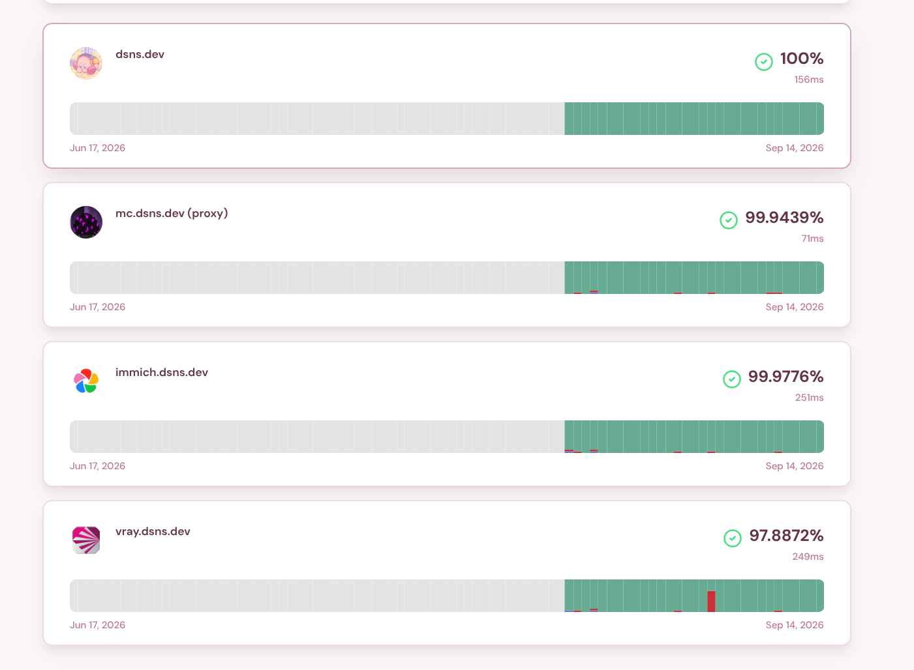

# Applications

This page lists what runs on the cluster today and what is planned. A replica count of 2 means the app runs twice, so a single pod failure causes no outage.

| App | Namespace | Status | Entry |
|-----|-----------|--------|-------|
| Minecraft Velocity and Limbo (`mc.dsns.dev`) | `minecraft` | Live (2 replicas, `itzg/mc-proxy:java25`, MC `26.2`, Velocity and Limbo handler and Simple Voice Chat) | `10.3.3.10:25577` TCP and UDP |
| Web Proxy (Traefik IngressRoutes) | `web-proxy` | Live | `10.3.3.10:443` |
| V2Ray VPN | `v2ray-vpn` | Live (2 replicas, `v2fly/v2fly-core`) | `vray.dsns.dev:10086` |
| Immich | Not deployed | Planned (IngressRoute and EndpointSlice stub exists, LAN backend `.172` pending) | `immich.dsns.dev` |
| T3 Code | Not deployed | Planned (IngressRoute and EndpointSlice stub exists, LAN backend `.195` pending) | `code.dsns.dev` |
| WireGuard VPN | Not deployed | Planned, no manifests yet | None |

## Details

- **Minecraft** (`apps/minecraft/`) has two parts. Velocity greets connecting players, and Limbo is a lightweight placeholder server where players wait. An init container copies `velocity.toml` and `forwarding.secret` (from the sealed `velocity-config` Secret) into place. The proxy is exposed on the shared `.10` VIP over TCP and UDP port `25577`. UDP carries Simple Voice Chat proximity audio.
- **V2Ray** (`apps/v2ray/`) runs `v2fly/v2fly-core` as a 2-replica Deployment. It mounts `config.json` from the sealed `v2ray-config` Secret and is exposed through Traefik at `vray.dsns.dev` on port 10086 (the `vray` ExternalName Service points at `v2ray-service.v2ray-vpn`).
- **Web Proxy** (`apps/web-proxy/`) holds the namespace, the wildcard `Certificate` objects, the `IngressRoute` objects (Traefik hostname-routing rules), and the headless Services with EndpointSlices for LAN backends (`.218` general proxy, `.195` coding host, `.172` photo host). See [Networking](networking.md#dns-and-tls).
- **Planned work:** Immich and T3 Code already have routes and slices, and only their LAN backends are pending. WireGuard has no manifests yet.

## Service Status

Public uptime is tracked on the [status page](https://status.seung.dev/) (Kener), which probes each endpoint from outside the cluster and keeps 90 days of history per monitor.

The current monitors map to the apps above: `dsns.dev`, `mc.dsns.dev (proxy)`, `immich.dsns.dev`, and `vray.dsns.dev`. The screenshot was captured in September 2026, so open the live page for current data. In-cluster metrics and alerting remain on the roadmap (see [Operations](operations.md#roadmap)).

## Adding an App

1. Add manifests under `apps/<name>/` (Deployment, Service, and sealed secrets as needed).
2. Register the app with an Argo CD Application in `argocd/apps/<name>-app.yaml` (copy an existing file as a starting point).
3. Push to `main`. Auto-sync installs the app within about 3 minutes. See [Operations](operations.md#gitops-workflow).
